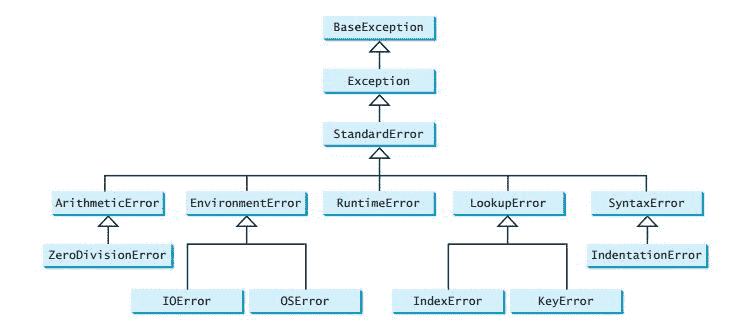

# Python 异常处理

> 原文： [https://thepythonguru.com/python-exception-handling/](https://thepythonguru.com/python-exception-handling/)

* * *

于 2020 年 1 月 7 日更新

* * *

异常处理使您能够优雅地处理错误并对其进行有意义的处理。 如果未找到所需文件，则向用户显示一条消息。 Python 使用`try`和`except`块处理异常。

**语法**：

```py
try:
    # write some code 
    # that might throw exception
except <ExceptionType>: 
    # Exception handler, alert the user

```

如您在`try`块中看到的那样，您需要编写可能引发异常的代码。 当发生异常时，将跳过`try`块中的代码。 如果`except`子句中存在匹配的异常类型，则执行其处理器。

让我们举个例子：

```py
try:
    f = open('somefile.txt', 'r')
    print(f.read())
    f.close()
except IOError:
    print('file not found')

```

上面的代码如下：

1.  执行`try`和`except`块之间的第一条语句。
2.  如果没有异常发生，则将跳过`except`子句下的代码。
3.  如果文件不存在，则会引发异常，并且`try`块中的其余代码将被跳过
4.  发生异常时，如果异常类型与`except`关键字后的异常名称匹配，则将执行该`except`子句中的代码。

**注意**：

上面的代码仅能处理`IOError`异常。 要处理其他类型的异常，您需要添加更多的`except`子句。

`try`语句可以具有多个`except`子句，也可以具有可选的`else`和/或`finally`语句。

```py
try:
    <body>
except <ExceptionType1>:
    <handler1>
except <ExceptionTypeN>:
    <handlerN>
except:
    <handlerExcept>
else:
    <process_else>
finally:
    <process_finally>

```

`except`子句类似于`elif`。 发生异常时，将检查该异常以匹配`except`子句中的异常类型。 如果找到匹配项，则执行匹配大小写的处理器。 另请注意，在最后的`except`子句中，`ExceptionType`被省略。 如果异常不匹配最后一个`except`子句之前的任何异常类型，则执行最后一个`except`子句的处理器。

**注意**：

`else`子句下的语句仅在没有引发异常时运行。

**注意**：

无论是否发生异常，`finally`子句中的语句都将运行。

现在举个例子。

```py
try:
    num1, num2 = eval(input("Enter two numbers, separated by a comma : "))
    result = num1 / num2
    print("Result is", result)

except ZeroDivisionError:
    print("Division by zero is error !!")

except SyntaxError:
    print("Comma is missing. Enter numbers separated by comma like this 1, 2")

except:
    print("Wrong input")

else:
    print("No exceptions")

finally:
    print("This will execute no matter what")

```

**注意**：

`eval()`函数允许 python 程序在其内部运行 python 代码，`eval()`需要一个字符串参数。

要了解有关`eval()`的更多信息，请访问 Python 中的[`eval()`](/python-builtin-functions/eval/)。

## 引发异常

* * *

要从您自己的方法引发异常，您需要像这样使用`raise`关键字

```py
raise ExceptionClass("Your argument")

```

让我们举个例子

```py
def enterage(age):
    if age < 0:
        raise ValueError("Only positive integers are allowed")

    if age % 2 == 0:
        print("age is even")
    else:
        print("age is odd")

try:
    num = int(input("Enter your age: "))
    enterage(num)

except ValueError:
    print("Only positive integers are allowed")
except:
    print("something is wrong")

```

运行程序并输入正整数。

**预期输出**：

```py
Enter your age: 12
age is even

```

再次运行该程序并输入一个负数。

**预期输出**：

```py
Enter your age: -12
Only integers are allowed

```

## 使用异常对象

* * *

现在您知道如何处理异常，在本节中，我们将学习如何在异常处理器代码中访问异常对象。 您可以使用以下代码将异常对象分配给变量。

```py
try:
    # this code is expected to throw exception
except ExceptionType as ex:
    # code to handle exception

```

如您所见，您可以将异常对象存储在变量`ex`中。 现在，您可以在异常处理器代码中使用此对象。

```py
try:
    number = eval(input("Enter a number: "))
    print("The number entered is", number)
except NameError as ex:
    print("Exception:", ex)

```

运行程序并输入一个数字。

**预期输出**：

```py
Enter a number: 34
The number entered is 34

```

再次运行程序并输入一个字符串。

**预期输出**：

```py
Enter a number: one
Exception: name 'one' is not defined

```

## 创建自定义异常类

* * *

您可以通过扩展`BaseException`类或`BaseException`的子类来创建自定义异常类。



如您所见，python 中的大多数异常类都是从`BaseException`类扩展而来的。 您可以从`BaseException`类或`BaseException`的子类（例如`RuntimeError`）派生自己的异常类。

创建一个名为`NegativeAgeException.py`的新文件，并编写以下代码。

```py
class NegativeAgeException(RuntimeError):
    def __init__(self, age):
        super().__init__()
        self.age = age

```

上面的代码创建了一个名为`NegativeAgeException`的新异常类，该异常类仅由使用`super().__init__()`调用父类构造器并设置`age`的构造器组成。

## 使用自定义异常类

* * *

```py
def enterage(age):
    if age < 0:
        raise NegativeAgeException("Only positive integers are allowed")

    if age % 2 == 0:
        print("age is even")
    else:
        print("age is odd")

try:
    num = int(input("Enter your age: "))
    enterage(num)
except NegativeAgeException:
    print("Only positive integers are allowed")
except:
    print("something is wrong")

```

在下一篇文章中，我们将学习 [Python 模块](/python-modules/)。

* * *

* * *