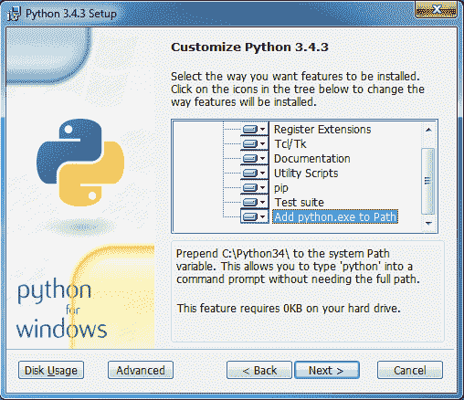
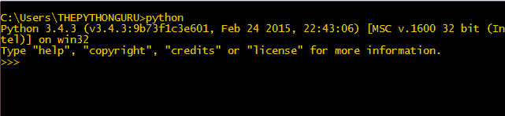
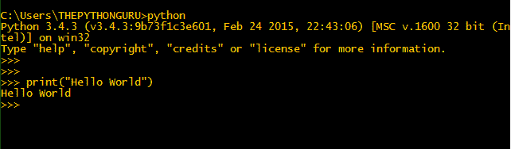
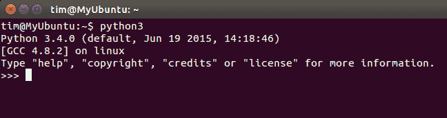

# 安装 Python3

> 原文： [https://thepythonguru.com/installing-python3/](https://thepythonguru.com/installing-python3/)

* * *

于 2020 年 1 月 7 日更新

* * *

本教程重点介绍 Python3。大多数 Linux 发行版，例如 Ubuntu 14.04，都安装了 python 2 和 3，这是下载链接。 如果您使用其他 Linux 发行版，请参阅此链接以获取安装说明。 Mac 还随附安装了 python 2 和 python 3（如果未查看此链接以获取说明），但 Windows 并非如此。

**注意：**

注意：在本教程中，我将仅在 Windows 和 Ubuntu 14.04 上提供必要的说明。

## 在 Windows 中安装 Python 3

* * *

要安装 python，您需要从 [https://www.python.org/downloads/](https://www.python.org/downloads/) 下载 python 二进制文件，特别是我们将使用 python 3.4.3，您可以在此处从[下载](https://www.python.org/downloads/release/python-343/) 。 安装时，请记住检查“将`Python.exe`添加到路径”（请参见下图）。



现在您已经安装了 python，打开命令提示符或终端并输入`python`。 现在您在 python shell 中。



要测试一切正常，请在 python shell 中键入以下命令。

```py
print("Hello World")

```



**预期输出：**

```py
Hello World

```

如果您使用的是已随附 python 2 和 python 3 的 Ubuntu 14.04，则需要输入`python3`而不是仅`python`才能输入 python 3 shell。



安装文本编辑器要编写 python 程序，您将需要一个文本编辑器，您可以使用文本编辑器（如记事本）。 如果要使用完整的文本编辑器，请使用 Notepad++ 或 SublimeText。 下载并安装您选择的文本编辑器。

现在您已经成功安装了 python 3 和文本编辑器，并准备继续进行下一章，在此我们将学习运行 python 程序的不同方法。

* * *

* * *