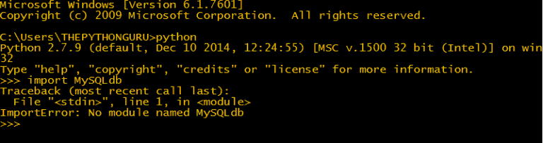

# 安装 Python MySQLdb

> 原文： [https://thepythonguru.com/installing-mysqldb/](https://thepythonguru.com/installing-mysqldb/)

* * *

于 2020 年 1 月 7 日更新

* * *

MySQLdb 是用于使用 python 访问 MySQL 数据库的 api。 它建立在 MySQL C API 之上。

MySQLdb 尚不支持 python 3，它仅支持 python 2.4-2.7。 因此，您需要在本教程中使用 python 2。 我们将使用 python 2.7.9，您可以从此处下载。

## 安装 MySQLdb

* * *

在安装之前，必须首先检查系统上是否已经安装了 MySQLdb。 要测试打开命令提示符或终端，然后启动 python shell 并键入以下代码

```py
import MySQLdb

```

如果它像这样抛出`ImportError`：



那么您需要安装 MySQLdb。 否则，您已经安装了 MySQLdb。

如果您在 Windows 上，请从从[下载 MySQLdb 并安装它。](http://sourceforge.net/projects/mysql-python/)

在下一篇文章中，我们将讨论[如何连接到访问数据库](/connecting-to-the-database/)。

* * *

* * *